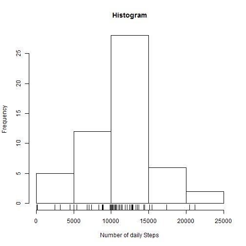
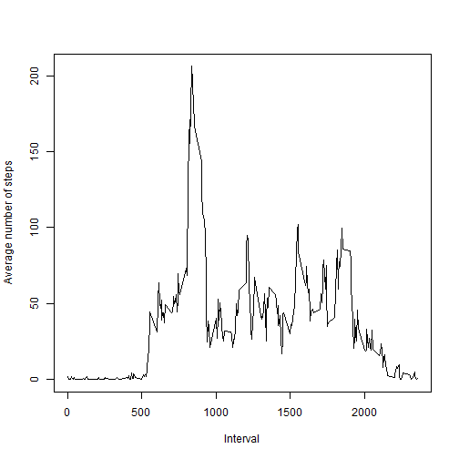
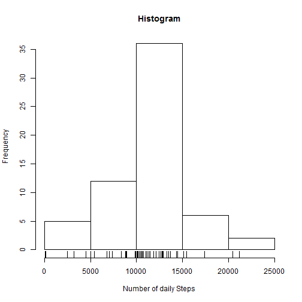
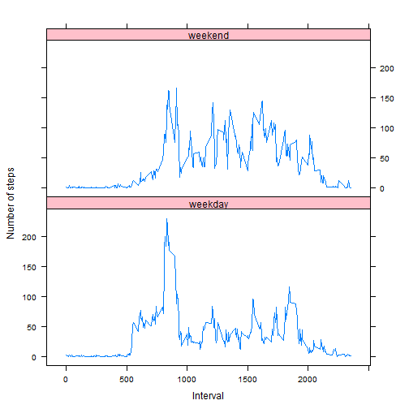

This work is done in fulfillment of first peer assessment of course Reproducible researc. We download the activity monitoring data of a single person and report some statistics and plot to get insights into the downloaded dataset. 

##Loading and preprocessing the data
In this section, we firstly unzip the data since the data files are in zip format. We then read the data file named "activity.csv" using read.csv() function. It is given that the missing values in the file are coded as "NA", so we set the appropriate argument of the function accordingly and we instruct the read.csv() function not to convert the strings to factors. The loaded dataset is stored in a dataframe variable of rawData. 

```r
unzip("activity.zip") 
rawData <- read.csv("activity.csv", header=TRUE, 
                    na.strings="NA", stringsAsFactors=FALSE)
```

The *date* variable of rawData is converted to the date class. 

```r
rawData$date <- as.Date(rawData$date)
```

##What is mean total number of steps taken per day?
In this section, we firstly ignore the missing values in the dataset and store the resulting dataframe in new variable called noNAdata. 


```r
# Let's discard the data with missing values
noNAdata <- rawData[!is.na(rawData$steps),]
```

We utilize *dplyr* package to manipulate the dataset. We utilize chain operations with dplyr package to make groups in the dataset and then to summarize these groups. 

```r
# loading the dplyr package
library(dplyr)
```

```
## 
## Attaching package: 'dplyr'
## 
## The following object is masked from 'package:stats':
## 
##     filter
## 
## The following objects are masked from 'package:base':
## 
##     intersect, setdiff, setequal, union
```
Firstly, we use group_by() function in *dplyr* package to group the dataset by date and then utilize summarize() function to compute the number of steps taken each day. The resulting dataframe is stored in a variable avg.daily. 

```r
# Grouping by the day and computing the mean for each day.
avg.daily <- noNAdata %>%
  group_by(date)  %>%
  summarize(dailySteps=sum(steps))
```
The number of steps taken each day is stored in dataframe avg.daily. We now draw its histogram using hist() function. We set the 'break' argument to 7 since it is found to result in reasonably shaped histogram. We also identify the exact location of a point below the histogram using rug() function. It helps us identify more clearly the concentration of points


```r
hist(avg.daily$dailySteps, breaks = 7, main="Histogram",
     xlab = "Number of daily Steps")
rug(avg.daily$dailySteps)
```

 


The mean of the total number of steps taken daily is as follows


```r
daily.avg.steps <- mean(avg.daily$dailySteps)
daily.avg.steps
```

```
## [1] 10766.19
```
The median of the total number of steps taken daily is as follows


```r
daily.median.steps <- median(avg.daily$dailySteps)
daily.median.steps
```

```
## [1] 10765
```

##What is the average daily activity pattern?

We know that a day is partitioned into intervals. In this section, we compute the average of the number of steps taken in each interval and compute the average daily activity pattern. This can also be done conveniently using the functions from *dplyr* package. We firstly group the data by 'interval' and then utilize summarize function to compute the average of the number of steps taken in each interval. The resulting dataframe is stored in avg.steps.interval.


```r
# Grouping by the interval and taking the average for that interval over all the days.
avg.steps.interval <- noNAdata %>%
  group_by(interval)  %>%
  summarize(avg.steps.in.interval=mean(steps))
```


We now plot the daily average activity pattern i.e., the average number of steps in each interval. 


```r
with(avg.steps.interval,
     plot(interval,avg.steps.in.interval, 
          type = "l", xlab = "Interval", 
          ylab = "Average number of steps"))
```

 


The maximum average number of steps taken and the respective interval are presented in the form of a dataframe with one row as follows 


```r
# Interval in which the maximum steps are taken
avg.steps.interval[avg.steps.interval$avg.steps.in.interval==max(avg.steps.interval$avg.steps.in.interval),]
```

```
## Source: local data frame [1 x 2]
## 
##   interval avg.steps.in.interval
## 1      835              206.1698
```

##Imputing missing values
Recall that our analysis so far has been based ignoring the missing data. It can induce some bias in our analysis. let us now, impute (fill) the missing values in the original dataframe which was stored in a dataframe variable rawData. It is to remark that we just utilitse the mean value of the number of steps taken in an interval, computed by ignoring the missing values to impute the missing values. 


Firstly, we define a vector called 'intervals' in which is the 'interval' column of the dataframe rawData. Recall, rawData contains the original data. We then define another vector called 'avg.steps' that contains the average number of steps corresponding to the 'interval' vector. We define the 'avg.steps' vector using the sapply() function in which we define an anonymous function that transforms an interval to the average number of steps taken in it. Note that sapply() is implements a *for* loop over its argument. 


```r
intervals <- rawData$interval
avg.steps <- sapply(intervals, function(x){
  avg.steps.interval[avg.steps.interval$interval == x,]$avg.steps.in.interval})
```

Secondly, we find the indexes of the missing data as follows. 


```r
Index <- is.na(rawData$steps)
```


We define a new dataframe called newData from rawData and impute the missing values as identified by 'Index' with the average number of steps taken in that interval as is stored in 'avg.steps'.


```r
newData <- rawData
newData[Index,]$steps <- avg.steps[Index]
```


We now repeat our analysis as before that was done after ignoring the missing values. Firstly we compute another dataframe with the number of steps taken each day. Like previously, it can be conveniently accomplished with dplyr package. 


```r
##What is mean total number of steps taken per day?
# Grouping by the day and computing the mean for each day
avg.daily <- newData %>%
  group_by(date)  %>%
  summarize(dailySteps=sum(steps))
```

We now plot the histogram using same arguments as before. 


```r
hist(avg.daily$dailySteps, breaks = 7, main="Histogram",
     xlab = "Number of daily Steps")
rug(avg.daily$dailySteps)
```

 


The mean of the total number of steps taken daily is as follows


```r
daily.avg.steps <- mean(avg.daily$dailySteps)
daily.avg.steps
```

```
## [1] 10766.19
```

The median of the total number of steps taken daily is as follows


```r
daily.median.steps <- median(avg.daily$dailySteps)
daily.median.steps
```

```
## [1] 10766.19
```

##Impact of imputing the missing values.
We find that the histogram of the average number of steps taken daily is slightly different when we impute the missing values. It is to note that we impute the missing values with the average of the number of steps in that interval. This similarity may be borne out of this type of imputation. For another type of imputation, the conclusion may be different. 

Further, we note that the average number of steps taken daily remain the same as before. It was expected since average number of steps in an interval was used to impute the missing values. We however, note that the median values these two different analyses are different. 

##Are there differences in activity patterns between weekdays and weekends?

In this section, we investigat the activity patterns between weekdays and the weekends. It is to note that we define Saturday and Sunday to be weekend. We firstly utilize 'mutate()' function of the *dplyr* package and define a new variable in the dataframe newData to contain the day of the week using the 'weekdays()' function as follows. Recall newData consist of imputed missing values and has no missing values. 


```r
newData <- mutate(newData, dayType=weekdays(date))
```

We utilise the dayType variable of the newData dataframe to make yet another factor variable called weekend with two levels "yes" and "no"


```r
newData$weekend <- "weekday"
newData[newData$dayType=="Saturday"|newData$dayType=="Sunday",]$weekend <- "weekend"
newData$weekend <- factor(newData$weekend)
newData$dayType <- NULL
```

We again employ functions from the *dplyr* package to group the data by interval and day type i.e., whether it is weekend or work day. This time, we group by two variables namely 'interval' and 'weekend' as follows. The results are stored in a new dataframe called newData.dayType.   


```r
newData.dayType <- newData %>%
  group_by(interval,weekend)  %>%
  summarize(avg.steps.in.interval=mean(steps))
```

We now make a panel plot with two time series plots consisting of the average number of steps taken daily as a function of interval. One plot consist of weekedn data and the other consist of the work day data. 


```r
names(newData.dayType)
```

```
## [1] "interval"              "weekend"               "avg.steps.in.interval"
```

```r
library(lattice)
xyplot(avg.steps.in.interval~interval|weekend, type="l", layout=c(1,2), 
       data = newData.dayType, xlab="Interval",ylab="Number of steps",
       par.settings = list(strip.background=list(col="pink")) 
)
```

 
